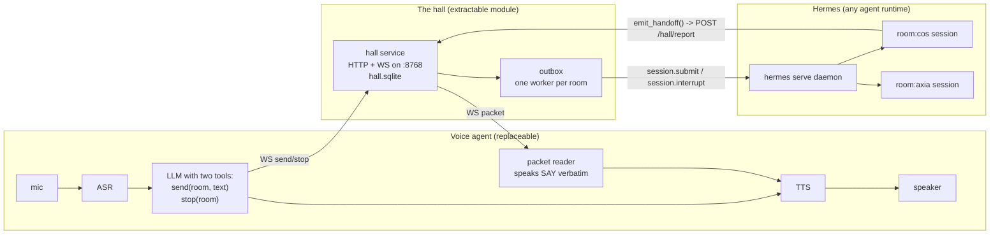

> Verbatim third-party document (Bootoshi). Do not edit below this line.

# The Chief of Staff voice architecture

Date: 2026-09-01. Grounded in code at these commits: `dgx-voice` `feat/hall-loop` @ `c4d0148`, `hermes-voice` @ `62f91e7`, `hermes-agent` branch `feat/hall-handoff-enforcement` @ `b23f39a`.

This document has one job: show the seams so that the voice half can be swapped for **any voice agent that can call functions**, and the Hermes half (the hall plus its enforcement) can be lifted out as its own module.

## 1. The shape in one picture



Three parts. Three owners. Two contracts between them.

| Part | Owns | Lives in |
|---|---|---|
| Voice agent | the ear, the mouth, the small fast LLM, the two tool bodies | `dgx-voice` (Pipecat) |
| The hall | packets, lights, rooms, the outbox, delivery to the agent runtime | `hermes-voice/src/service/hall*.ts` |
| Hermes | the room sessions, the required `emit_handoff` tool, the turn-end guard | `hermes-agent` `tools/handoff.py`, `agent/handoff_stop.py` |

The hall is the only thing in the middle. The voice agent never touches Hermes. Hermes never touches the voice agent. That is why either side can be replaced.

## 2. Contract A: voice agent to hall

The voice agent needs exactly two tools and one listener. Nothing else.

### 2.1 The two tools

The LLM sees these function schemas (from `voice_server.py:configure_hall_tools`):

```json
{"name": "send", "parameters": {"room": "string", "text": "string"}}
{"name": "stop", "parameters": {"room": "string"}}
```

Tool descriptions the LLM reads, in plain words:

- `send`: "Send a message through a project door. Each room is a durable project conversation; use room `cos` for the chief of staff by default. The acknowledgement only confirms delivery. The reply arrives later as a packet and is read aloud automatically, so do not wait for or invent the reply."
- `stop`: "Stop the work in a room."

The tool body is one WebSocket frame each. The ack comes back on the same socket, matched by `request_id`:

```
-> {"type":"send","request_id":"<uuid>","room":"cos","text":"..."}
<- {"type":"ack","request_id":"<uuid>","ok":true}

-> {"type":"stop","request_id":"<uuid>","room":"cos"}
<- {"type":"ack","request_id":"<uuid>","ok":true}
```

`ok:false` carries an `error` string. The voice side returns `{"ok":false,"error":...}` to the LLM as the tool result. Nothing is retried; the hall is durable, so a lost ack means "ask again," not "resend blindly."

### 2.2 The listener

The same socket delivers packets, in order, while the voice agent is connected:

```
<- {"type":"summary","rooms":[{"room":"cos","light":"green","pending":1,"last_state":"done"}, ...]}
<- {"type":"packet","packet":{"id":33,"room":"cos","state":"done","say":"...","did":"...","need":"...","next":"...","created_at":"..."}}
```

On connect the hall replays every pending packet. The voice agent reads `say` aloud **verbatim**, then tells the hall:

```
-> {"type":"consumed","packet_id":33}
```

Only after `consumed` does the packet leave the pending list and the room light go idle. If the voice agent dies mid-sentence, the packet is still pending and gets replayed on the next connect. Packets that arrive when no call is live are left alone (`hall_voice.py:_listen`: "hall retains ownership").

### 2.3 What the voice agent must guarantee

1. **SAY is spoken as-is.** The small model never rephrases a packet. In Pipecat this is a `TTSSpeakFrame`, which bypasses the LLM. Any replacement agent needs the same primitive: "speak this exact string now."
2. **Speak only in silence.** The reader waits until neither the bot nor the user is speaking (`_quiet` event), then speaks `"Packet from <room>:"` followed by `say`.
3. **Consume after the audio finishes**, not after the send. The reader waits for `BotStoppedSpeaking` before it sends `consumed`.
4. **Give the LLM the memory.** After speaking, the reader appends a system message with all five fields so the next turn can discuss it (`_context_note`).
5. **The tool result is the ack, nothing more.** The system prompt says: never wait for or invent the reply.

### 2.4 Two more HTTP calls (optional but used)

| Call | When | Purpose |
|---|---|---|
| `GET /hall/briefing?note=` | before a call (prefetched at start and at re-arm; it takes ~18 s) | one spoken paragraph from room `cos`, placed in the system prompt |
| `POST /hall/absorb {transcript}` | after a call | hands the call transcript to room `cos` so the next briefing knows what was said |

Both go to room `cos` through the same outbox. They are conveniences, not part of the core contract.

### 2.5 Auth

Bearer token from a 0600 file (`~/.ompvoice/hall-token` on the hall host; the voice side reads its own copy). Machine to machine only. Per ADR-0022 nothing a human opens in a browser carries a token; the tailnet is that perimeter.

## 3. Contract B: hall to Hermes

The hall does not know what an "agent" is. It knows a `Dispatch` function:

```ts
type Dispatch = (item: OutboxItem) => Promise<{ text: string }>;
// OutboxItem = { id, room_id, kind: "send" | "stop", text? }
```

The default `dispatchToHermes` (`hall.ts`):

1. Resolve the room to a Hermes session titled `room:<name>`. Create it if missing, resume it if present.
2. `send` → `session.submit(sid, text)`; wait for the turn to finish.
3. `stop` → `session.interrupt(sid)`.

That is the whole Hermes dependency of the hall: three RPCs on one supervised `hermes serve` daemon (`serve.ts`). Swap the `Dispatch` and the hall drives a different runtime.

### 3.1 The packet comes back through a tool, not through the reply

The turn's text reply is **not** what the user hears. Hermes must call `emit_handoff` during the turn:

```json
{
  "name": "emit_handoff",
  "strict": true,
  "parameters": {
    "state": "done | blocked | needs-decision",
    "say":   "string, 1..350 chars, spoken verbatim",
    "did":   "string",
    "need":  "string",
    "next":  "string"
  }
}
```

The tool body (`tools/handoff.py`) POSTs `{room, state, say, did, need, next}` to `POST /hall/report` with the bearer token. The hall validates all five fields, writes the packet, broadcasts it on the WebSocket, and answers `{ok:true, packet_id}`. That JSON is the tool result Hermes sees.

### 3.2 Enforcement lives in Hermes, not in the prompt

Three layers make the handoff unskippable (`agent/handoff_stop.py`, wired in `agent_init.py:1612` and `conversation_loop.py:8391`):

1. **Gating.** `emit_handoff` is in the tool list only when the session title starts with `room:`. Ordinary sessions never see it.
2. **Stop guard.** When a room turn tries to end in plain text with no successful `emit_handoff` in this turn's messages, the loop injects the nudge `"Call emit_handoff(state, say, did, need, next) to complete the turn"` and continues. Two nudges max.
3. **Loud failure.** After two nudges, the turn ends with `"Room turn failed: emit_handoff did not succeed after two required-handoff nudges."` No silent fallback, no packet invented from the text.

Success is judged structurally: a `role: tool, name: emit_handoff` message whose JSON content has `ok: true`. The hall's verdict is the source of truth, not the model's claim.

## 4. The hall itself: what you would extract

Files: `hermes-voice/src/service/hall.ts`, `hall-store.ts`, `hall-entry.ts` (~470 lines of TypeScript on Bun, SQLite via `bun:sqlite`). Zero voice code. One Hermes-shaped `Dispatch`.

### 4.1 Tables (`hall-store.ts`)

| Table | Columns | Meaning |
|---|---|---|
| `rooms` | `room_id`, `last_state`, timestamps | one row per door |
| `room_packets` | `id`, `room_id`, `state`, `say`, `did`, `need`, `next`, `status` (`pending`/`consumed`), `created_at` | what the agent handed back |
| `outbox` | `id`, `room_id`, `kind` (`send`/`stop`), `text`, `status` (`pending`/`dispatching`/`done`/`failed`), `error` | what the user sent in |

Lights are derived, never stored: `green` when a room has any pending packet, else `idle`.

### 4.2 Guarantees

- **Durable both ways.** Inbound messages are rows before they are dispatched. Outbound packets are rows before they are broadcast. Restart recovery: `dispatching` rows go back to `pending`; pending packets are replayed to every new socket.
- **One worker per room, in order.** `HallOutbox` claims the next row per room atomically (`UPDATE ... WHERE status='pending'`) and runs one dispatch at a time per room. Rooms run in parallel with each other.
- **Fail closed on shape.** `/hall/report` returns 422 with the list of bad field names; nothing partial is stored.
- **Ownership is explicit.** A packet is the hall's until a consumer says `consumed`. There is no timeout that auto-consumes.

### 4.3 Surface

| Method | Path | Body / frames | Answer |
|---|---|---|---|
| WS | `/hall/ws` | `send`, `stop`, `consumed` frames | `ack`, `summary`, `packet` frames |
| POST | `/hall/report` | five-field packet + `room` | `{ok, packet_id}` or 422 `{ok:false, errors:[...]}` |
| GET | `/hall/summary` | | `{rooms:[{room, light, pending, last_state}]}` |
| GET | `/hall/briefing?note=` | | `{briefing}` (30 s cap, then a fixed "unavailable" string) |
| POST | `/hall/absorb` | `{transcript}` | `{ok:true}` |

Binds `127.0.0.1` and the Tailscale address, port `8768`. Bearer token on every route.

## 5. How to replace the voice agent

Any agent that can (a) call two functions, (b) speak an exact string outside the LLM, and (c) hold one WebSocket qualifies. Checklist:

1. Register `send(room, text)` and `stop(room)` with the descriptions in 2.1. Put the room rule in the system prompt: `cos` is the default door; replies come later as packets; never invent a reply.
2. Open `ws://<hall>:8768/hall/ws` with the bearer token. Map `request_id` to a future for acks. Queue `packet` frames.
3. Implement the reader from 2.3: wait for quiet, speak `"Packet from <room>:"` then `say` verbatim, wait for playout end, add the five fields to context, send `consumed`.
4. Optional: fetch `/hall/briefing` ahead of the call, post `/hall/absorb` after it.

What you do not need: Pipecat, the speaker gate, NVIDIA ASR/TTS, the FaceTime or WebRTC doors. Those are this project's voice base. The hall does not know they exist.

Examples of agents that fit: an OpenAI Realtime session (function calling plus `response.create` with an exact text), a LiveKit agent, a Vapi/Retell-style hosted agent with a webhook tool, or a text-only chat client that prints `say` instead of speaking it.

## 6. How to replace Hermes

Any runtime that can hold a named, resumable session and expose a strict tool fits. Checklist:

1. Implement `Dispatch`: resolve `room_id` to a session, submit text for `send`, interrupt for `stop`.
2. Give room sessions one strict tool, `emit_handoff`, whose body POSTs to `/hall/report` and returns the hall's JSON verdict as the tool result.
3. Enforce the turn end the way `handoff_stop.py` does: tool present only in room sessions; a plain-text ending gets a nudge; two nudges then a loud failure. Judge success by the tool result's `ok:true`, never by prose.

If the runtime cannot enforce (3), the hall still fails closed: a turn that never reports produces no packet and no green light. The user hears silence for that room, which is honest. But the enforcement is what makes the packet arrive every time, so it is the part worth porting.

## 7. Timing facts worth carrying over

- The `send` ack returns as soon as the row is stored. The user is never held while Hermes thinks.
- A packet reaches the ear only in silence, so a mid-sentence packet waits for the user to stop.
- `/hall/briefing` is a full Hermes turn (~18 s measured, CONNECT-0001). Prefetch it; never fetch it inside a connect or a turn.
- One hall WebSocket per voice process. The hall replays pending packets on every reconnect, so reconnects are free.

## 8. Laws this design answers to

- Ada ADR-0003 `two-events-five-fields` (amended 2026-08-31, `~/Dev/ada/docs/adr` on the mini): a room handoff is a required function call with five fields; the hall is the validator.
- Ada ADR-0006 `the-hall-owns-rooms-and-handoffs`: the hall owns packets, lights, rooms, and reply routing.
- `hermes-voice` ADR-0003: voice makes macro calls, omp owns micro permissions.
- `~/.omp/agent/adr` 0008 (durable truth vs coordination) and 0013 (one ingress envelope): the outbox and packet tables are that law applied.

## Related

- `~/Dev/ada/docs/adr/0003-two-events-five-fields.md`, `0006-the-hall-owns-rooms-and-handoffs.md` (mini).
- `src/dgx_voice/hall.py` (client), `src/dgx_voice/hall_voice.py` (reader), `src/dgx_voice/voice_server.py:configure_hall_tools`.
- `hermes-voice/src/service/hall.ts`, `hall-store.ts`, `serve.ts`.
- `hermes-agent/tools/handoff.py`, `agent/handoff_stop.py`, `tests/agent/test_handoff_room.py`.
